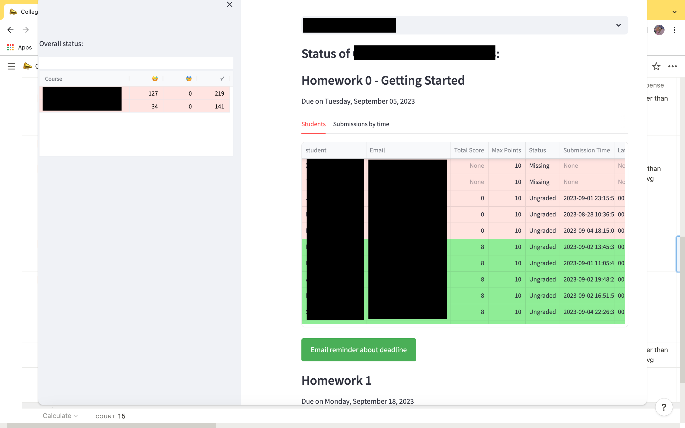

# Gradescope-Canvas Dashboard


Welcome to the Penn [Computer and Information Science Department](https://www.cis.upenn.edu/) Teaching Dashboard!  This project develops a *data dashboard* and grading platform for courses that combine *Canvas*, *Gradescope*, and spreadsheet (shared Excel or Google Sheets) components.  It has two roles:

* Continuous monitoring of student progress (including missed deadlines and low scores).  This could ultimately be used to define triggers.
* Grade assessment / grade finalizaiton across different components.  Adjust thresholds, see histograms!

Our goal is a single aggregation point for tracking student progress (and triggering alarms as appropriate) across many courses.  Ultimately there will be both "pull" and "push" components (messages vs dashboard).  Through a shared spreadsheet the teaching and advising staff can keep notes about each student, in addition to the data in Gradescope and Canvas.



We pull from both the Gradescope and Canvas APIs.  In addition, various mechanisms have been implemented to allow the grades in one system (e.g., Gradescope) override the (potentially partly synced) grades in the other system.  Additional fields can be maintained by the staff, including e.g., *Adjustments*, *Comments*, and *Participation*, through an Excel sheet (which can be concurrently edited in Google Sheets).

## Getting Started

This library requires a bit of setup to ensure it crawls Gradescope and Canvas appropriately.

### Pre-configuration

Let's assume you have a course set up with both Canvas and Gradescope (though you don't need to utilize Canvas).

1. Log into Canvas, go into Account, Settings, and create a **New Access Token** (give it a name like "Canvas Monitoring") and copy the key.
1. Set up an email account for the Teaching Dashboard, e.g., via Outlook.com or GMail.  Add this account as an Instructor in your Gradescope course.

### Enabling Dashboard Access to Canvas and Gradescope

Copy `config.yaml.default` to `config.yaml`. Update the `config.yaml` as follows:
* Change the YAML key `gradescope` / `gs_login` to the Gradescope email address of an account given instructor permission on the courses you want to monitor.
* Update `gradescope` / `gs_pwd` to the password for above account.
* Update `canvas` / `api_key` to the new Canvas access token you created above.
* Set `site` to your Canvas host URL (e.g., `https://canvas.upenn.edu` for Penn)

Next you'll want to restrict the courses-crawled to a subset of the available ones:
* `canvas` key, `course_ids` list: a list of specific Canvas course IDs to crawl, rather than all that are currently active.  Each should be on a *separate line indented with a leading dash*.  **To get the Canvas ID, you just need to go to the Canvas course site and copy the numeric ID at the end of the URL.**
* `gradescope` / `semesters`: a list of the Gradescope "years" / semesters to crawl.  You can see these in Gradescope under **Your Courses**, e.g., "Fall 2023."

Depending on whether you use Gradescope, Canvas, or both for your course, you can also enable or disable crawling of the site (`enabled` key in each section of the YAML file) or display (`show` key in each section). *Caveat: the dashboard has been most extensively tested with integrated Canvas and Gradescope.*

### Setting up Your Python Environment

We assume Python 3.9 or higher.  Set up and run an Anaconda environment (you may need to substitute `python3` and `pip3` for `python` and `pip` below, depending on your setup):

```bash
python -m venv venv
chmod +x venv/bin/activate
source venv/bin/activate
pip install -r requirements.txt
```

Now you should be ready to do your first crawl!

### Crawling Data

Crawling is easy (but, fair warning -- Canvas throttles data fetching in a terrible way):

```bash
python collect_events.py
```

After the script runs, there should be a series of files in the `data` directory:
* `gs_courses.csv` / `canvas_courses.csv`: list of courses to which we have access
* `gs_assignments.csv` / `canvas_assignments.csv`: list of student assignments (quizzes, exams, HWs)
* `gs_students.csv` / `canvas_students.csv`: list of enrolled students by course_id
* `gs_extensions.csv` / `canvas_student_summaries.csv`: list of student info including late days, extensions, etc.
* `gs_submissions.csv` / `canvas_submissions.csv`: list of homework submissions including timestamps, whether late, etc.

In addition, the Teaching Dashboard creates a SQLite3 database instance, in the form of the file `dashboard.db`.  Actual operations are done over this database.

Each time you re-run the crawler, it will overwrite the existing data.

**TODO: in a future release, we will *only crawl Canvas submissions updated after the last-changed date*.**

### Seeing/updating the data manually
You should be able to run `sqlite3` followed by `.open dashboard.db` to access the database.  `.tables` will show all tables, `.schema {tablename}` will show the schema, `select * from {tablename}` will show contents. Use `.quit` to exit.

## Assignments

By default, the Teaching Dashboard pulls all Assignments from Canvas (including info on late penalties applied).  It pulls all Assignments from Gradescope, including how late they are (we assume the teaching staff have already applied adjustments for late penalties).

**There are functions to display student progress for all assignments, but these are currently disabled because each quiz counts as an assignment.  Instead you probably want to cluster your assignments in a *Rubric*.**

## Classifying Your Assignments: Rubrics

Virtually every class categorizes different deliverables and assigns a point value.  To get a birds-eye view of progress, you may want to set up a *grading rubric* in your `config.yaml` file.  Towards the end of the sample file you should see something like this:

```
rubric:
  1234:
    midterm1:
      substring: Midterm 1
      points: 15
      max_score: 80
      max_extra_credit: 0
      source: Gradescope
    quizzes:
      substring: review
      points: 7
      max_score: 210
      max_extra_credit: 0
      source: Canvas
```

The first key (`1234`) represents the *Canvas SIS Number* for your course.  You can easily get this by logging into your course Canvas site and looking at the number at the end of the URL.

Next we have a series of blocks representing different rubric components.  You can name each key as you prefer; each will show up as a score component table and as a column in the student scores.  There are several important keys to specify:

* `substring`.  The Dashboard will collect every Assignment in Gradescope and in Canvas.  Anything which has a name matching the `substring` will be considered part of this rubric item.

* `source` (optional).  Sometimes Canvas and Gradescope will be partly synced. You can limit your rubric item to only consider `Canvas` entries or only consider `Gradescope` entries. By default it considers any source.

* `points`. How many points in your final rubric (e.g., percentage points) is this item worth?

* `max_score` (optional). Sometimes you will allow for extra credit or other items.  The `max_score` represents the baseline for 100% credit. Default: the maximum score comes from the Gradescope or Canvas entry.

* `max_extra_credit` (optional). If students are allowed to exceed the `max_score`, do we threshold the extra credit? Default: no threshold.

### Supplemental Fields

For many courses, we would like to include additional information throughout the semester, which does not have a natural home in Gradescope or Canvas. Fortunately the Teaching Dashboard easily accommodates!

You may add *supplemental fields* to the rubric, e.g., for course participation, late penalties, etc.  These should be in an Excel spreadsheet called `more-fields-{canvas_SIS_number}.xlsx`, along with student info from Gradescope *(First Name, Last Name, SID, Email)*.

A template is provided as *more-fields-1234.xlsx* and you may copy it to your course number. It's suggested you download the Gradescope grade file and copy the leftmost few fields directly into this sheet.

Suggested fields include **Adjustments** (added to the final student score, without any scaling and without counting against the baseline), **Comments** (notes shown in the output table as grade assignments are done), and possibly **Participation** if you do not track this through quizzes or other mechanisms. Optionally one might include **Penalties**, e.g., for academic integrity issues.

## The Interactive Dashboard

On a daily basis, you should run the crawler tool to generate a fresh version of your course data (perhaps through `chron`):

```
python collect_events.py
```

To see the dashboard, run:

```
streamlit run dashboard.py
```

The Dashboard has a left pane with your assigned / crawled courses; along with counters of successful submissions and late assignments.  On the right pane, there is a course selector, followed by a *Status* tab with each component of your rubric, and a *Grading* tab with the ability to set letter grade cutoffs automatically and see a histogram of distributions.  From this you may also download a `.csv` file that can be used in grading!

## Potential Future To-Dos:
* Add auto late penalties in the system.
* Add download from Gradescope Review Similarity for each assignment?
* Generate ics for all deadlines?

## Details/Credits on Gradescope "APIs"

We leverage and adapt the `pyscope` API, which we have updated to 2023 Gradescope with extensions.  Gradescope does not really have an external API, but through some clever work by prior authors, HTML crawling is used to pull the important data and wrap it in objects.  Substantial additional work was done to link every Gradescope student to their underlying SIS user ID.

**Credit**: The original `pyscope` codebase is derived from Sagar Reddy Patil's Gradescope iCalendar Converter, [sagarredypatil/gradescope-ics](https://github.com/sagarredypatil/gradescope-ics). In turn this leverages a Gradescope extraction codebase from Anton Pozharski, [apozharski/gradescope-api](https://github.com/apozharski/gradescope-api).  This overall package inherits the AGPL license as a result of this.

However, new subsystems developed as part of this project use the standard Apache 2 license.

**Major enhancements to gradescope-ics**:
* Support for extracting courses for which we have either *instructor* or *student* access.  Instructor access has more comprehensive support, e.g., of downloading rosters.
* Instructor access uses the full **assignments** page rather than the main dashboard, for comprehensiveness.  This requires changes to parsing.
* New `course.get_roster()` API call.
* Roster extraction update to match the 2023 HTML formatting of Gradescope.
* Crawl roster settings to get student SIS IDs.
* Homework assignment extraction now pulls the assignment ID.
* Extraction of homework submissions.
* Extraction of homework extensions.

## Details / Credits on the Canvas APIs

We leverage the Canvas LTI APIs from the U of Florida library.  Substantial layering over these libraries has been added in the `pycanvas` package, and a common API between the Canvas and Gradescope modules has been implemented as `CourseApi`.

